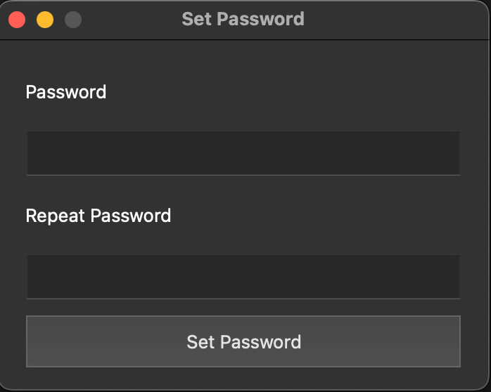
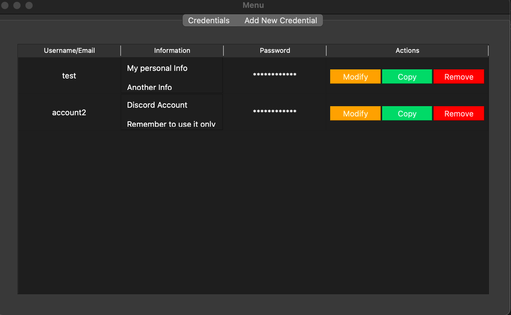
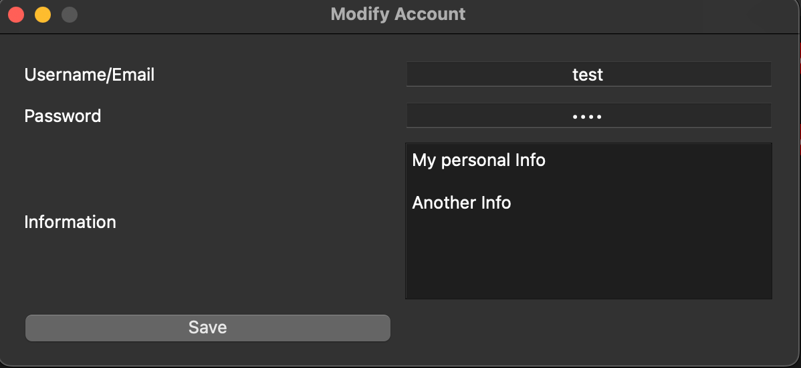

# Enpass
## Password Manager - Secure, Offline Python Application

This is a simple yet robust password manager built with Python and a graphical user interface (GUI) to securely manage and store your passwords offline. The project was developed for those who prefer full control over their data, without relying on third-party password managers, ensuring complete offline functionality and added security.

# Key Features

- Account Management: Users can securely store, update, or delete account credentials, each consisting of a username/email, password, and a description. A copy-to-clipboard feature allows for quick, safe access to passwords.
- Strong Data Encryption: AES-256 encryption is applied to all account data, with each encryption secured by a unique 16-byte salt to ensure robust data protection. Data integrity is reinforced with HMAC, helping detect any potential tampering.
- Master Password Security: Access is protected by a master password that requires a strong format (uppercase, lowercase, numbers, special characters, minimum 12 characters). The master password is hashed using PBKDF2 with 1,000,000 iterations and SHA-256 to derive the encryption key, enhancing security.
- Secure Data File Storage: Data is stored in a single, encrypted file, npss.ea, which incorporates both the salt and encrypted data, ensuring that sensitive information remains fully encrypted and locally stored.

# Why This Password Manager?
Most password managers store sensitive information on cloud servers, potentially exposing it to data breaches. This manager is designed for those who prioritize security by keeping passwords offline. It is perfect for personal use, providing both flexibility and control without sacrificing data protection.

# Some Images from the project

